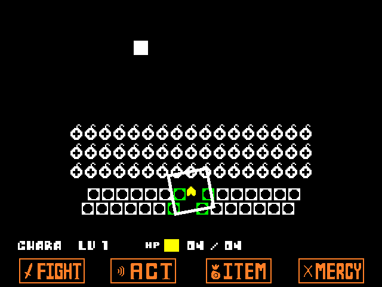
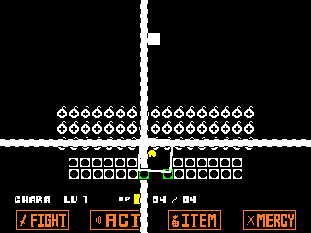

# ENDLESS METTATON (Godot 3)

This is the repository for an <b>ENDLESS METTATON</b>, an UNDERTALE fan-game I was developing in Godot Engine 3.6.

I've since moved development the project to Godot 4.7 in a new repository, so this version of the game was abandoned.

## Screenshots
<table>
	<td valign=top></td>
	<td valign=top></td>
</table>